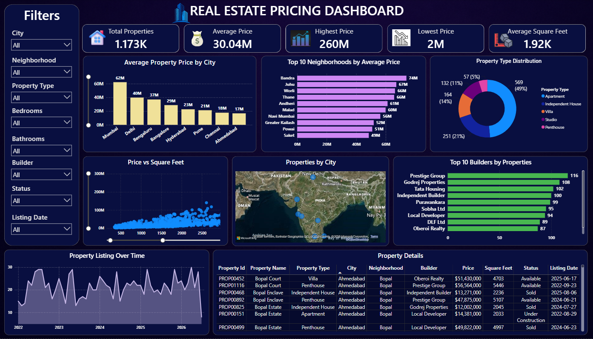

# 🏠 Task 1: Real Estate Pricing Dashboard

## 🎯 Project Objective

The objective of this project is to analyze real estate property listings and build an interactive Power BI dashboard that provides clear insights into property prices, locations, property types, builders, and listing trends.

The dashboard transforms raw real estate data into an easy-to-understand visual report for exploring property market patterns and pricing insights.

---

## 📊 Dashboard Overview

This interactive dashboard provides a comprehensive overview of **1,173 real estate property listings**.

### Key KPIs

- 🏠 Total Properties: 1.173K
- 💰 Average Property Price: 30.04M
- 📈 Highest Property Price: 260M
- 📉 Lowest Property Price: 2M
- 📐 Average Square Feet: 1.92K

---

## 📌 Dashboard Features

### 1. Average Property Price by City
A comparison of average property prices across different cities.

### 2. Top 10 Neighborhoods by Average Price
Highlights the neighborhoods with the highest average property prices.

### 3. Property Type Distribution
Shows the distribution of properties across:
- Apartment
- Independent House
- Villa
- Studio
- Penthouse

### 4. Price vs Square Feet
Analyzes the relationship between property price and property size.

### 5. Properties by City
An interactive map showing the geographical distribution of property listings.

### 6. Top 10 Builders by Properties
Displays builders with the highest number of property listings.

### 7. Property Listing Over Time
Shows how property listings have changed over the listing period.

### 8. Property Details
Provides detailed information about individual properties, including:
- Property ID
- Property Name
- Property Type
- City
- Neighborhood
- Builder
- Price
- Square Feet
- Status
- Listing Date

---

## 🎛️ Interactive Filters

The dashboard includes filters for:

- City
- Neighborhood
- Property Type
- Bedrooms
- Bathrooms
- Builder
- Status
- Listing Date

These filters allow users to explore specific segments of the real estate dataset.

---

## 📁 Dataset

The dataset contains **1,173 property records and 17 columns**.

### Dataset Fields

| Field | Description |
|---|---|
| Property_ID | Unique property identifier |
| Property_Name | Name of the property |
| City | Property city |
| Neighborhood | Property neighborhood |
| Price | Property price |
| Bedrooms | Number of bedrooms |
| Bathrooms | Number of bathrooms |
| Square_Feet | Property area |
| Property_Type | Type of property |
| Latitude | Geographic latitude |
| Longitude | Geographic longitude |
| School_Distance | Distance from school |
| Parking | Parking availability |
| Age_of_Property | Age of the property |
| Status | Property availability/status |
| Builder | Property builder |
| Listing_Date | Date when the property was listed |

---

## 🛠️ Tools & Technologies

- Microsoft Power BI
- SQL
- CSV Dataset
- Data Analysis
- Data Visualization

---

## 📈 Key Insights

The dashboard helps users identify:

- Cities with higher average property prices
- High-value neighborhoods
- Distribution of different property types
- Relationship between property price and square footage
- Builders with the highest number of listings
- Geographical distribution of properties
- Property listing trends over time
- Individual property-level details

---

## 🖼️ Dashboard Preview

---

## 🎓 Internship Learning

This project demonstrates practical experience in:

- Data analysis
- Data visualization
- Dashboard development
- SQL querying
- KPI creation
- Interactive filtering
- Geographic data visualization
- Business-oriented insight generation

---

## 📌 Project Outcome

A complete interactive Real Estate Pricing Dashboard was developed using Power BI to convert raw property listing data into meaningful and actionable visual insights.

