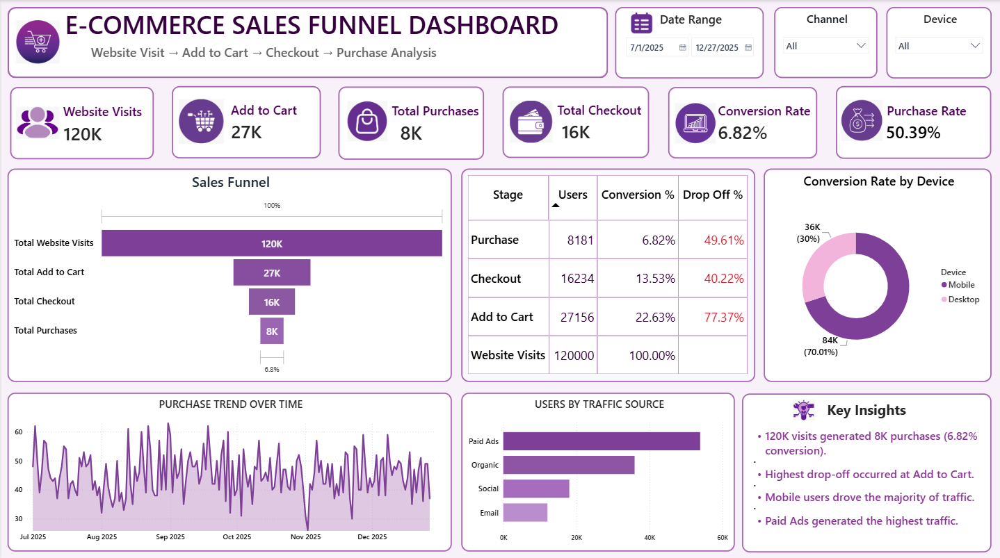

# 🛒 E-Commerce Sales Funnel Dashboard

## 📊 Project Overview

The E-Commerce Sales Funnel Dashboard is an interactive Power BI dashboard designed to analyze the customer journey from website visits to completed purchases.

The dashboard provides a clear view of the complete sales funnel:

**Website Visits → Add to Cart → Checkout → Purchase**

It helps identify customer drop-offs, conversion performance, device-wise behavior, traffic sources, and purchase trends over time.

---

## 🎯 Objectives

- Analyze the complete e-commerce sales funnel
- Track website visits, cart additions, checkouts, and purchases
- Measure conversion and drop-off rates
- Compare customer activity across devices
- Analyze traffic sources
- Monitor purchase trends over time
- Identify key business insights

---

## 🛠️ Tools & Technologies

- Power BI
- DAX
- Power Query
- Data Visualization
- Data Analysis
- CSV Dataset

---

## 📁 Dataset

The project uses the `d2c_marketing_funnel_data.csv` dataset.

The dataset contains e-commerce customer activity and marketing funnel information such as:

- Date
- Device
- Channel
- User Type
- Campaign Type
- Region
- Session ID
- User ID
- Website Visits
- Viewed Product
- Add to Cart
- Checkout
- Purchase
- Revenue
- Order Value

---

## 📌 Dashboard Features

### 1. KPI Cards

The dashboard includes important performance indicators:

- Website Visits
- Add to Cart
- Total Purchases
- Total Checkout
- Conversion Rate
- Purchase Rate

### 2. Sales Funnel

The funnel visual represents the customer journey:

**Website Visits → Add to Cart → Checkout → Purchase**

It helps identify where customers are dropping out of the purchasing journey.

### 3. Funnel Analysis Matrix

The matrix provides:

- Stage
- Users
- Conversion %
- Drop Off %

This makes it easier to compare the performance of every funnel stage.

### 4. Conversion Rate by Device

A donut chart compares conversion performance between:

- Mobile
- Desktop

### 5. Purchase Trend Over Time

A time-series chart shows how purchases change over the selected date range.

### 6. Users by Traffic Source

A bar chart compares users generated through different marketing channels such as:

- Paid Ads
- Organic
- Social
- Email

### 7. Interactive Filters

The dashboard includes:

- Date Range
- Channel
- Device

These filters allow users to interactively explore the dashboard.

---

## 📈 Key Insights

- The dashboard tracks the complete customer journey from website visits to purchases.
- The highest customer drop-off occurs during the early funnel stages.
- Mobile users contribute a significant share of website traffic.
- Paid Ads generate the highest traffic among the available traffic sources.
- The overall conversion rate is approximately 6.82% for the displayed dashboard period.

---

## 🎨 Dashboard Design

The dashboard uses a clean and professional purple/lavender theme with:

- KPI cards
- Rounded containers
- Interactive slicers
- Funnel visualization
- Matrix analysis
- Donut chart
- Trend analysis
- Traffic source comparison

---

## 📷 Dashboard Preview

---

## 📂 Project Files

| File | Description |
|------|-------------|
| `Ecommerce_Sales_Funnel_Dashboard.pbix` | Power BI dashboard file |
| `d2c_marketing_funnel_data.csv` | Dataset used for analysis |
| `Funnel_Dashboard.png` | Dashboard preview |
| `README.md` | Project documentation |

---

## 👩‍💻 Author

**Rushda Fatima**

BCA Student | Data Analytics Enthusiast

Skills: Power BI • Tableau • SQL • Excel • Python • Data Analysis
