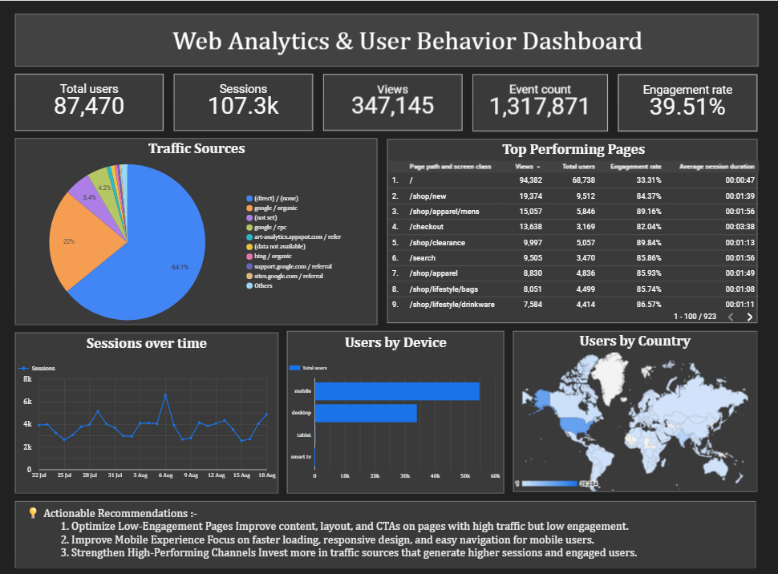

# 📊 Web Analytics & User Behavior Tracking Dashboard

A web analytics dashboard built using **Google Analytics 4 (GA4)** and **Looker Studio** to analyze website traffic, user behavior, engagement, device usage, geographic distribution, and top-performing pages.

---

## 🚀 Project Overview

This project focuses on transforming Google Analytics 4 data into an interactive reporting dashboard using Looker Studio.

The dashboard tracks:

* 👥 Total Users
* 🔄 Sessions
* 👁️ Page Views
* ⚡ Event Count
* 📈 Engagement Rate
* 🌐 Traffic Sources
* 📄 Top Performing Pages
* 📱 Users by Device
* 🌍 Users by Country
* 📊 Sessions Over Time

---

## 🛠️ Tech Stack

* **Google Analytics 4 (GA4)**
* **Looker Studio**
* **Google Analytics Data**

---

## 🔗 Live Dashboard

👉 **Looker Studio Dashboard:** [View Dashboard](https://datastudio.google.com/s/mKrEkCwb_ec)

---

## 📸 Dashboard Preview

---

## 📌 Key Dashboard Metrics

| Metric          |         Value |
| --------------- | ------------: |
| Total Users     |    **87,470** |
| Sessions        |    **107.3K** |
| Views           |   **347,145** |
| Event Count     | **1,317,871** |
| Engagement Rate |    **39.51%** |

---

## 📊 Dashboard Components

### 1. Traffic Sources

The traffic source visualization shows where website users are coming from, including direct traffic, organic search, CPC, and referral channels.

### 2. Top Performing Pages

Page performance is analyzed using:

* Views
* Total Users
* Engagement Rate
* Average Session Duration

### 3. Sessions Over Time

The time-series chart tracks website sessions and helps identify traffic trends, spikes, and low-traffic periods.

### 4. Users by Device

The dashboard compares users across:

* 📱 Mobile
* 💻 Desktop
* 📟 Tablet
* 📺 Smart TV

### 5. Users by Country

The geographic visualization provides an overview of user distribution across different countries and helps identify major user markets.

---

## 💡 Key Insights

* **Direct traffic** represents a significant portion of overall website traffic.
* Several **shopping and product pages** show strong engagement.
* **Mobile users** represent the largest device segment, making mobile optimization particularly important.
* The **checkout page** demonstrates relatively high engagement and average session duration.

---

## 🎯 Actionable Recommendations

### 1. Optimize Low-Engagement Pages

Improve content, layout, navigation, and CTAs on pages with high traffic but low engagement.

### 2. Improve Mobile Experience

Focus on faster loading, responsive design, simple navigation, and mobile-friendly CTAs.

### 3. Strengthen High-Performing Channels

Invest more in traffic sources that generate high-quality sessions and engaged users.

### 4. Improve Landing Pages

Optimize high-traffic landing pages to encourage users to explore more content and products.

### 5. Monitor User Behavior

Continuously track traffic, engagement, sessions, page performance, device usage, and acquisition channels through GA4 and Looker Studio.

---

## 🔄 Analytics Workflow

text

Website
   ↓
Google Analytics 4
   ↓
GA4 Data
   ↓
Looker Studio
   ↓
Interactive Dashboard
   ↓
Insights & Recommendations

---

## 🎓 Learning Outcomes

Through this project, we demonstrated skills in:

* Google Analytics 4
* Looker Studio
* Web traffic analysis
* User behavior analysis
* KPI tracking
* Data visualization
* Traffic source analysis
* Page performance analysis
* Device and geographic analysis
* Data-driven recommendations

---

## 🎯 Project Objective

The objective of this project is to create a **real-time web analytics reporting solution** that converts GA4 data into meaningful visual insights.

The dashboard helps stakeholders understand website performance and make **data-driven decisions to improve user engagement and retention**.

---

## 🏁 Conclusion

This Web Analytics & User Behavior Tracking Dashboard combines acquisition, engagement, page-level, device, geographic, and time-based analysis in one interactive reporting solution.

By connecting **Google Analytics 4 with Looker Studio**, raw analytics data is transformed into actionable insights that can support better website optimization and user retention strategies.

---

## 👨‍💻 Project Information

**Project:** Web Analytics & User Behavior Tracking

**Tech Stack:** Google Analytics 4 (GA4), Looker Studio

**Focus:** Website Analytics, User Behavior & Engagement

---

