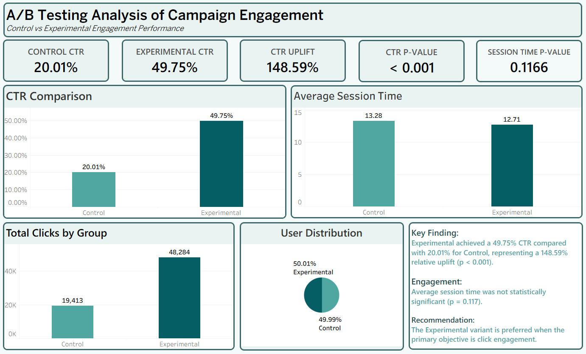

# Task 2 — A/B Testing Analysis

## 📌 Project Overview

This project focuses on analyzing an A/B test to evaluate the performance of a Control group against an Experimental group.

The primary objective was to determine whether the Experimental variant improved user click engagement and whether there was any significant difference in session time between the two groups.

The analysis was performed using Python for data cleaning, statistical analysis, and hypothesis testing, followed by Tableau for dashboard development and visualization.

---

## 🎯 Objectives

- Compare Click-Through Rate (CTR) between Control and Experimental groups
- Measure CTR uplift of the Experimental variant
- Perform statistical significance testing
- Analyze average session time
- Determine whether session-time differences are statistically significant
- Build an interactive Tableau dashboard to communicate the findings

---

## 🛠️ Tools & Technologies

- Python
- Pandas
- NumPy
- SciPy
- Matplotlib
- Jupyter Notebook
- Tableau
- GitHub

---

## 📂 Dataset

The dataset contains user-level campaign engagement information, including:

- `click` — Whether the user clicked
- `group` — Control or Experimental group
- `session_time` — User session duration
- `click_time` — Timestamp of the click/session activity
- `device_type` — Device used by the user
- `referral_source` — Source through which the user arrived

---

## 🧹 Data Cleaning

The original dataset contained:

- 200,020 rows
- 6 columns

After data cleaning and removing invalid/incomplete records:

- 194,054 clean rows remained

The cleaned dataset was then used for the A/B testing analysis.

---

## 📊 Key Metrics

| Metric | Control | Experimental |
|---|---:|---:|
| Users | 97,002 | 97,052 |
| Clicks | 19,413 | 48,284 |
| CTR | 20.01% | 49.75% |
| Average Session Time | 13.28 | 12.71 |

---

## 📈 A/B Testing Results

### CTR Analysis

The Control group achieved a CTR of **20.01%**, while the Experimental group achieved **49.75%**.

The Experimental variant produced:

- **CTR Uplift:** 148.59%
- **CTR Difference:** 29.74 percentage points
- **p-value:** < 0.001

The difference in CTR is statistically significant.

### Session Time Analysis

Average session time was:

- Control: **13.28**
- Experimental: **12.71**

The statistical test produced a p-value of **0.1166**.

Therefore, the difference in average session time is **not statistically significant**.

---

## 💡 Key Findings

The Experimental variant significantly improved click engagement compared with the Control group.

However, there is no statistically significant evidence that the Experimental variant changed average session time.

Therefore, if the primary business objective is **increasing click engagement**, the Experimental variant is the preferred option.

---

## 📊 Tableau Dashboard

The Tableau dashboard provides a visual summary of:

- Control vs Experimental CTR
- Average Session Time
- Total Clicks by Group
- User Distribution
- CTR Uplift
- Statistical test results
- Key findings and recommendation

---

## 🖼️ Dashboard Preview

---

## 📁 Project Files

- `task2_ab_testing.ipynb` — Python analysis and statistical testing
- `ab_test_dataset.csv` — Original dataset
- `ab_testing_clean.csv` — Cleaned dataset
- `Task_2_AB_Testing.twbx` — Tableau packaged workbook
- `Dashboard_AB.png` — Final Tableau dashboard

---

## ✅ Conclusion

The A/B testing analysis demonstrates that the Experimental variant achieved substantially higher click engagement than the Control variant.

With a CTR of **49.75% compared with 20.01%** and a statistically significant p-value of **< 0.001**, the Experimental variant is recommended when the primary goal is to increase user clicks.
